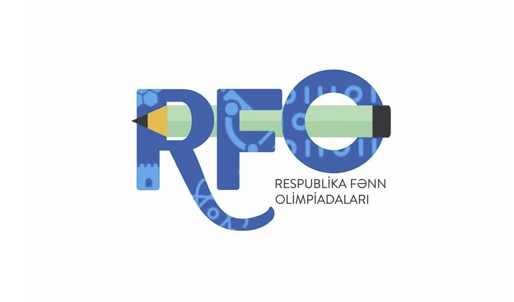

# 🏆 RFO Solutions - Azerbaijani Informatics Olympiad

Welcome to my collection of solutions for the **Azerbaijani Informatics Olympiad** (RFO - Respublika Fənn Olimpiadası)! This repository contains competitive programming solutions written in `Python` and `C++`.

## 🚀 About

This repository showcases solutions to various algorithmic problems from the Azerbaijani National Informatics Olympiad. Each solution demonstrates different programming concepts.

## 🎯 Purpose

These solutions serve as:

- Learning resources for competitive programming
- Reference implementations for algorithmic problems
- Practice material for future olympiad participants

## 📚 Getting Started

1. Clone this repository
2. Navigate to any solution file
3. Run the code with appropriate test inputs
4. Study the algorithmic approach used

## Star History

## 🤝 Contributing

Want to contribute? Check out our [Contributing Guidelines](CONTRIBUTING.md) for detailed instructions.

---

_Good luck with your competitive programming journey! 🌟_
